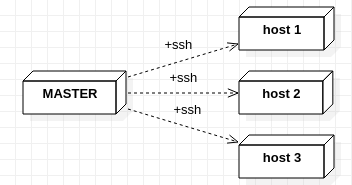
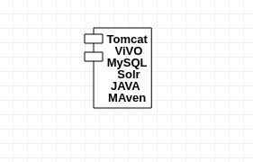
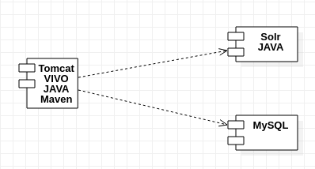

VIVO es un software de código abierto y una ontología para representar el conocimiento, que admite la grabación, edición, búsqueda, navegación y visualización de actividades académicas. Este anima a exhibir el registro académico, el descubrimiento de investigaciones, la búsqueda de expertos, el análisis de redes y la evaluación del impacto de la investigación.

Este manual pretende describir un método de instalación para este sistema.  Aclaramos que no es la única forma ni la forma definitiva, mientras avanzamos con nuevas configuraciones o adicionando plugins para obtener un nuevo comportamiento; entonces nuestro código de instalación de VIVO debe ir actualizándose, pero no cambia la forma de proceder con este manual. En el propio repositorio de código también estarán los pasos para la correcta instalación.

Esclarecemos que este es un código libre, en el que todas las universidades pueden colaborar y creamos así una comunidad para mejorar e intercambiar.

## Requisitos de Hardware
Los requisitos mínimos recomendados son: `2 core, 8GB de RAM, 100GB HDD`. Esto estará en dependencia de los servidores con que se cuente, puede pensar en reducir la memoria RAM a 4GB y el almacenamiento a 50GB, pero tenga presente que esto afectará el performance del sistema, además, a largo plazo seguramente necesite más espacio de almacenamiento. Tenga esto presente si en el futuro no puede modificar el tamaño de almacenamiento del servidor o contenedor donde se instalará. 

Por otro lado, como se verá más adelante, la instalación puede realizarse distribuyendo los diferentes componentes de VIVO en diferentes servidores, lo que significaría que deben analizarse los requisitos mínimos de dichos componentes.

## Requisitos de Software
La instalación propuesta se realiza sobre Sistema Operativo libre, nosotros describimos específicamente en Ubuntu 18.04. 
Para el correcto funcionamiento se necesita acceso a Internet para la instalación de los paquetes, partiendo de ahí, el software necesita de un conjunto de tecnologías y herramientas: Java 8 OpenJDK como su versión mínima, Maven 3.0.3 para gestionar los paquetes de instalación, MySQL como base de datos SQL, Tomcat 7 como servidor web y Solr para los indices de búsqueda. Además, es necesario acceso a los repositorios de Ubuntu para la correcta instalación de los sistemas antes mencionados. Pero no se preocupe que nada de ello lo hará manualmente, con solo escribir algunas configuraciones en un fichero y ejecutar un comando en una terminal todo estará listo.

## Pasos previos necesarios
El método de instalación es a través de Ansible, esta es una plataforma de software libre para configurar y administrar ordenadores o servidores. Es una forma simple de automatizar aplicaciones e infraestructura. Ansible funciona configurando máquinas clientes llamadas “host” desde una computadora (master) que posee instalado los componentes. La comunicación es a través de SSH por lo que no requiere la instalación de software adicionales en el cliente (Figura 1).

 

*Figura1: Computadora máster controlando vía SSH un grupo de host*

### 1. Configuración del master:

+ 1.1.  Para instalar Ansible en Ubuntu 18.04 es necesario en una terminal ejecutar los siguientes comandos:
        $ sudo apt update
        $ sudo apt install software-properties-common
        $ sudo apt-add-repository –yes –update ppa:ansible/ansible
        $ sudo apt install ansible

  Si prefiere instalar Ansible con pip basta con ejecutar

        $ pip install –user ansible

  Para más información u otro método de instalación puede leerlo en el [sitio oficial](https://docs.ansible.com/ansible/latest/installation_guide/intro_installation.html)

+ 1.2.  Instalar el sistema de control de versiones Git

      $ sudo apt install git

+ 1.3.  Clonar el repositorio de instalación de VIVO

        $ git clone https://github.upr.edu.cu/vivo/vivo-install.git

  Es importante subrayar que, siendo un proyecto de código abierto, este repositorio puede ser mejorado por la comunidad.

+ 1.4.  Crear, si no existe, una llave pública 

        $ ssh-keygen

### 2. Configuracion de los hosts:

VIVO se compone de tres sistemas fundamentales, el código que se ejecuta, la base de datos (MySQL) y el motor de búsqueda (Solr). Estos pueden estar todos en un mismo contenedor o pueden estar distribuidos como muestran los siguientes esquemas:





La elección dependerá de cada institución, pero tenga presente que será necesario realizar salvas periódicas de la información y la elección afectará el proceso de cómo hacer las salvas.
En cualquier caso, para el proceso de instalación, lo relevante es determinar cuáles son los “hosts” que el master configurará. Las acciones a realizar son las siguientes:

+ 2.1. Crear los contenedores o Máquinas Virtuales necesarios para su instalación de VIVO. Debe tener en consideración para cada servidor el componente de VIVO que instalará y sus requisitos mínimos.

+ 2.2. Ponerle la llave pública creada en el master (paso 1.4) a todos los hosts

  - 2.2.1. Copiar la llave pública a todos host por el medio que usted crea conveniete
  - 2.2.2. Crear, si no existe, la carpeta “.ssh”

        $ mkdir –p /root/.ssh

  - 2.2.3. Situado en la carpeta donde copió la llave pública, añadala a los authorized_keys ejecutando 

        $ cat “mi_llave_pública.pub” >> /root/.ssh/authorized_keys

  - 2.3. Compruebe que desde el máster puede acceder ejecutando

        $ ssh root@”dirección_ip_del_host”

### 3. Pasos para instalar
En el servidor master:

+ 3.1. Moverse para la carpeta playbook dentro de vivo-install

+ 3.2. Editar el fichero “production” de la carpeta “inventories”

  - 3.2.1. Cambie las direcciones IPs para que se ajusten a su contexto, si todo el sistema estará en el mismo contenedor estos IPs serán el mismo. `OJO` no cambie los nombres que aparecen entre corchetes, por ejemplo: `[vivo]`; solo cambie los IPs.

+ 3.3. Editar los ficheros `vivo`, `mysql` y `solr` de la carpeta `group_vars` para ajustarlo a las necesidades
  - 3.3.1. `ubuntu_repo` es la URL donde se encuentra el repositorio de Ubuntu, por ejemplo: repos.upr.edu.cu
  - 3.3.2. `proxy__host` es la URL del proxy por el cual salen las peticiones
  - 3.3.3. `proxy__protocol` es el protocolo http o https
  - 3.3.4.  `proxy__port` es el puerto a través del cual se conecta el proxy
  - 3.3.5.  `mysql__name` es el nombre de la base de datos para VIVO
  - 3.3.6.  `mysql__user`  es el nombre del usuario con acceso a la base de datos de VIVO
  - 3.3.7.  `mysql__password` es la contraseña del usuario que tiene acceso a la base de datos
  - 3.3.8.  `mysql__url` es la URL donde se encuentra la base de datos. Ejemplo: jdbc:mysql://<<IP_mysql | dominio>>/<<databsename>>
  - 3.3.9. `vitro__defaultNamespace` es la URL para las URIs generadas de los objetos editados. Ejemplo: http://<<IP_vivo|dominio>>:8080/vivo/individual/
  - 3.3.10.  `vitro__solr_url` es la URL donde se encuentra el buscador de VIVO. Ejemplo: http://<<IP_Solr | dominio>>:8983/solr/vivocore
  - 3.3.11.  `admin__email` es el correo electrónico del administrador del sistema. Ejemplo: biblioteca@upr.edu.cu
  - 3.3.12. `email__smtpHost` es la dirección URL del servidor smtp para enviar correos

  **Nota:** Mantengase al tanto de actualizaciones sobre el repositorio de vivo-install porque pueden ocurrir cambios o actualizaciones sobre lo antes descrito.

**Nota:** Si usted no desea instalar nuevamente MySQL porque ya tiene un servidor destinado a ello y quiere colocar la base de datos de VIVO en ese servidor, entonces debe hacer lo siguiente

 En el fichero `vivo.yml` comentar con el signo de número (#) las siguientes lineas

 ```yaml
 - name: mysql
   hosts: mysql
   remote_user: root
   roles:
     - role: mysql 
       become: yes
       vars:
         mysql_databases:
           - {name: "{{ mysql_name }}", collation: utf8mb4_unicode_ci, encoding: utf8mb4}
         mysql_users:
           - {name: "{{ mysql_user }}", host: '%', password: "{{ mysql_password }}", priv: "{{ mysql_name }}.*:ALL" }
 ```

+ 3.4. En la consola, moverse a la carpeta “playbook” y ejecutar el comando siguiente

        $ ansible-playbook vivo.yml


En la consola visualizará como se van ejecutando las tareas automáticamente, al terminar tendrá instalado VIVO. Usted debe entrar con el email del admin y la contraseña por defecto es `rootPassword` por favor cámbiela para mantener la seguridad de su sistema.


## Autores

<a href="https://crai.upr.edu.cu">

</a>
<a href="https://tocororo.upr.edu.cu">

</a>
</br></br>
<a href="http://www.upr.edu.cu">

</a>